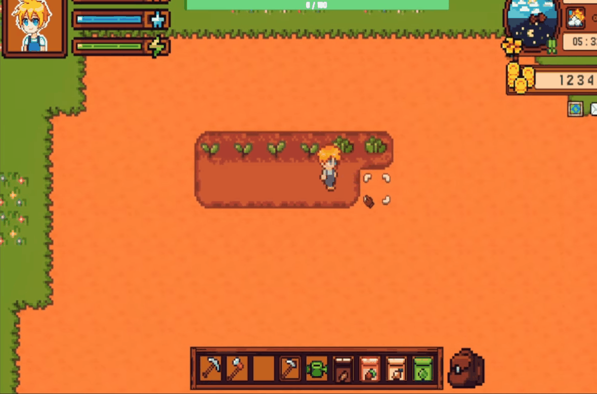
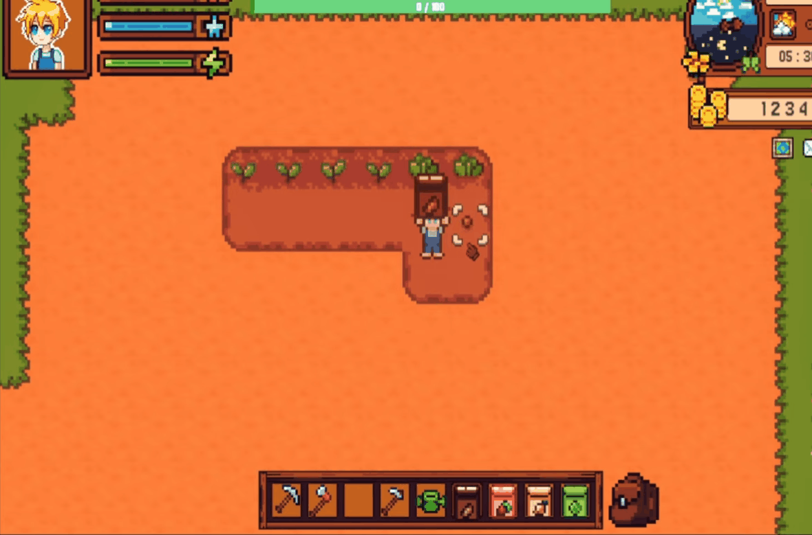
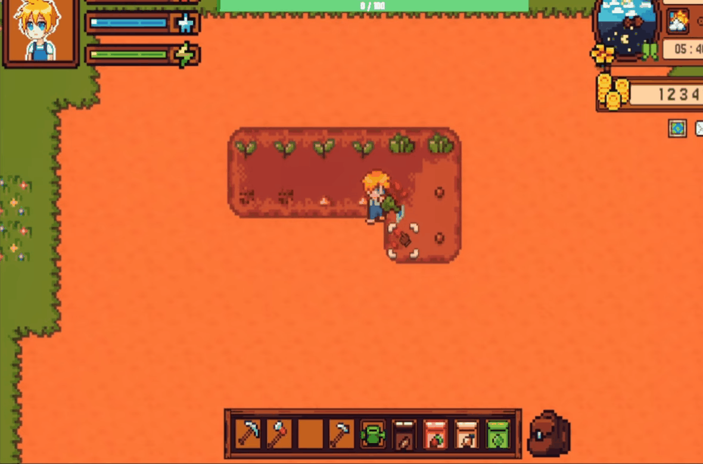
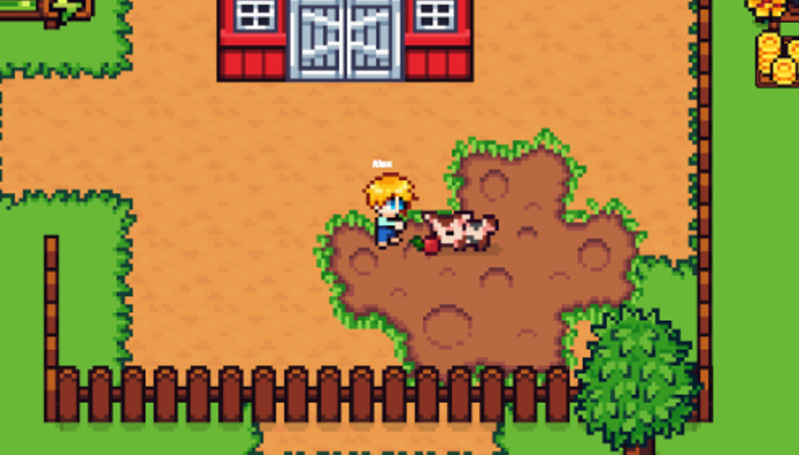
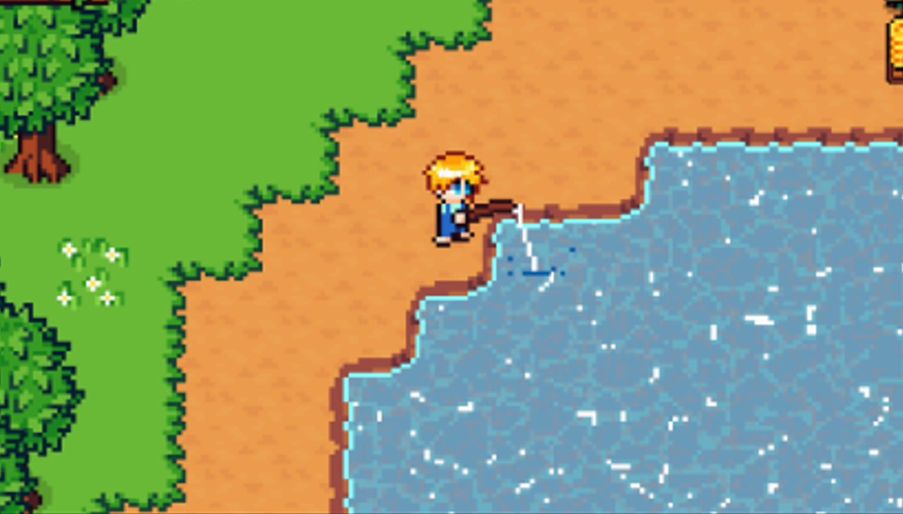
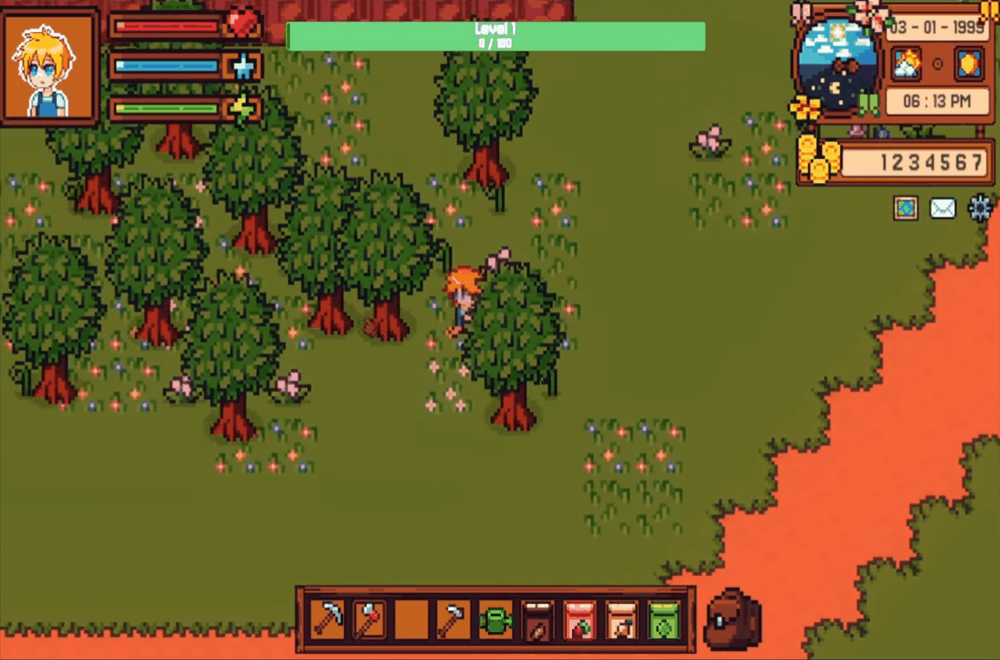
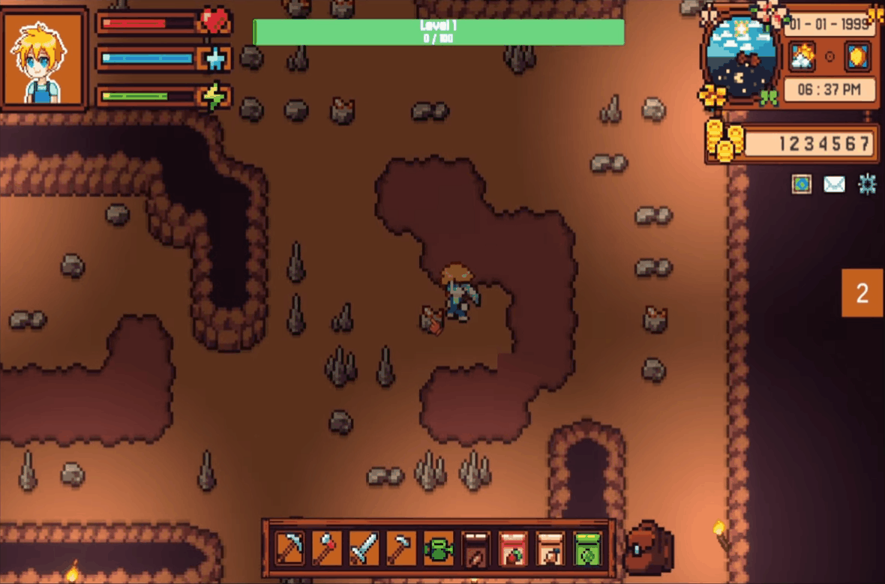
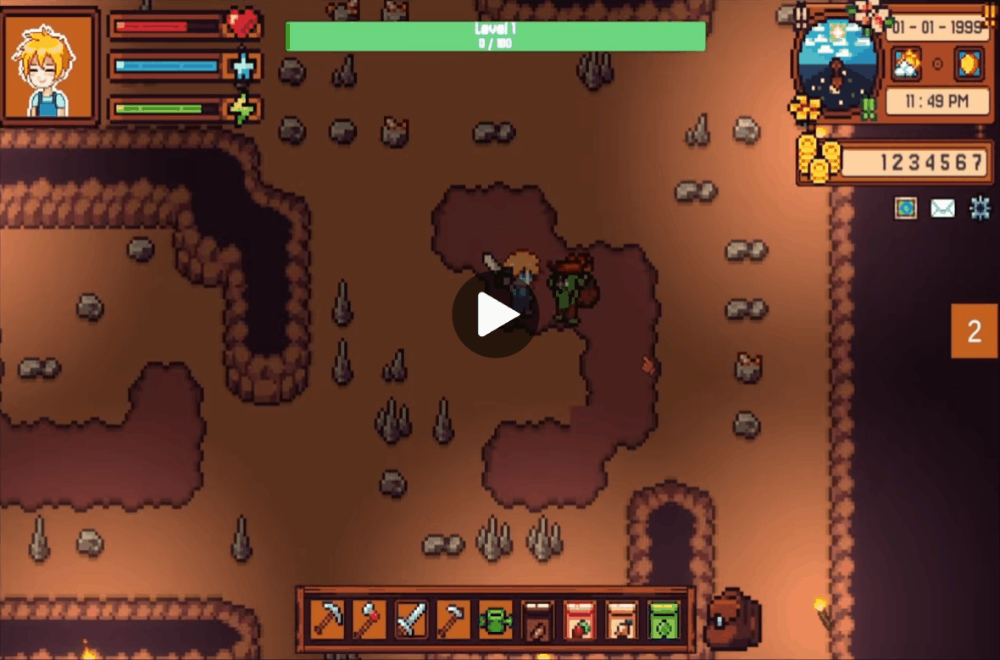

<!-- BANNER -->

  

<h1 align="center">A Farming Simulation Game Developed at VTC Academy</h1>

  

  
  
  
  

---

## 👋 Introduction

This repository showcases a team-developed Unity project inspired by farming simulation games.

I worked as a **Gameplay Programmer**, responsible for implementing **core gameplay systems** that drive the player experience.

My work includes:
- Grid-based farming mechanics
- Animal interaction and production systems
- Resource gathering and item drops
- Fishing system
- Mine exploration with combat and AI behavior

> 🔍 This README focuses on my ability to design gameplay systems, apply common patterns (Singleton, FSM, event-driven architecture), and optimize performance in Unity.
>
> ⚠️ Due to overlapping development with other projects, this project was not taken to a fully polished release stage.
>
> Instead, it was used as a **focused learning environment** to experiment with gameplay systems, AI behavior, and performance optimization techniques.
---

## 📅 Development Timeline

- Development period: March 2025 - June 2025
- Team size: 3 members

The project was developed iteratively, focusing on implementing multiple interconnected gameplay systems within a limited timeframe.

---

## 📚 Table of Contents

* [About The Project](#-about-the-project)
* [Team & Contributors](#-team--contributors)
* [Gameplay Preview](#-gameplay-preview)
* [Key Features](#-key-features)
* [My Contribution](#-my-contribution)
* [Technical Challenges & Observations](#-technical-challenges--observations)
* [Proposed Improvements](#-proposed-improvements)
* [Tech Stack](#️-tech-stack)
* [Design Approach](#-design-approach)
* [What I Learned](#-what-i-learned)

---

## 📌 About The Project

This is a **top-down farming simulation game** featuring multiple interconnected gameplay systems.

* Genre: Farming Simulation  
* Role: Gameplay Programmer  
* Focus: Gameplay systems, interaction, and AI behavior  

Core gameplay includes:

* Farming (plant, water, harvest)
* Animal raising and production
* Resource gathering (wood, stone, ores)
* Fishing mechanics
* Mine exploration with enemies and combat

(<a href="#readme-top">back to top</a>)

---

## 🤝 Team & Contributors

  
  
  

<table align="center">
  <tr>
    <td align="center"><b>Hau Tran</b></td>
    <td align="center"><b>Tri Lau</b></td>
    <td align="center"><b>Ridotakarin</b></td>
  </tr>
  <tr>
    <td align="center">Gameplay Programmer</td>
    <td align="center">System & UI Programmer</td>
    <td align="center">Design & QA</td>
  </tr>
  <tr>
    <td align="center">
      Farming System, Animal Interaction, 
      Resource Gathering, Fishing, 
      Mine System & Combat, Enemy AI
    </td>
    <td align="center">
      Character Controller, Save/Load, 
      UI, Inventory, Audio, Shop System, 
      NPC AI, Dialogue, Cutscene, Time System
    </td>
    <td align="center">
      Dialogue Writing, 
      Sound Design, 
      Documentation & Testing
    </td>
  </tr>
</table>

---

## 🖼️ Gameplay Preview

<b>Farming System</b>

  
  
  

 

<b>Animals and Fishing</b>

  
  

<b>Resources Gathering</b>

  
  

 

<b>Combat System</b>

  

(<a href="#readme-top">back to top</a>)

---

## ✨ Key Features

* **Grid-based Farming System**
  * Unified interaction system for planting and watering
  * Time-based crop growth

* **Animal Production System**
  * Feeding and growth over time
  * Resource output system

* **Resource Gathering System**
  * Tree cutting, mining rocks and ores
  * Drop system for materials

* **Fishing System**
  * Interactive gameplay mechanic

* **Mine System**
  * Procedurally generated layout (tile-based)
  * Random spawning of enemies and resources

* **Enemy AI (FSM)**
  * Pathfinding and obstacle avoidance
  * Chase → lose target → return to patrol behavior

* **Interaction System**
  * Grid-based and context-based interactions across gameplay systems

* **Movement Mechanics**
  * Bicycle and horse riding
 
* **Event-driven System (Scriptable Events)**
  * Decoupled communication using ScriptableObject-based event system

* **Performance Optimization**
  * Object Pooling for frequently spawned objects
  * Camera-based culling for tiles and objects outside of view

* **AI Architecture**
  * Finite State Machine (FSM) for enemy behavior

(<a href="#readme-top">back to top</a>)

---

## 👤 My Contribution

I implemented multiple **core gameplay systems** that interact with each other to form the main game loop.

### Gameplay Systems
* Grid-based farming system (planting, watering, growth)
* Animal system (feeding, growth, production)
* Resource gathering system (wood, stone, ores)
* Fishing system

### Mine & Combat
* Procedural mine generation (tile-based + random spawn)
* Enemy AI using Finite State Machine (FSM)
* Combat interactions within mine area

### Interaction System
* Grid-based interaction system reused across farming, mining, and other gameplay features

### Movement
* Bicycle and horse mechanics

### UI & Audio
* Gameplay interaction UI
* Sound effects integration

> 💡 Focus: Building reusable gameplay systems and handling interactions between multiple mechanics.

(<a href="#readme-top">back to top</a>)

---

## 🧠 Technical Challenges & Observations

### 1. System Complexity
Handling multiple gameplay systems (farming, AI, mining, fishing) increased complexity and required careful coordination.

### 2. Grid Interaction Design
Designing a flexible grid-based interaction system that supports multiple actions (planting, watering, mining) was challenging.

### 3. AI Behavior
Balancing enemy behavior between chasing, losing target, and patrolling required tuning and iteration.

---

## 🚀 Proposed Improvements

* Improve system modularity and separation of concerns
* Refactor AI into a more scalable architecture
* Optimize performance in mine generation and spawning
* Enhance feedback for player actions (VFX, UI clarity)

---

## 🛠️ Tech Stack

* Unity
* C#
* Tilemap / Grid System

---

## 🧩 Design Approach

This project focuses on building **reusable and decoupled gameplay systems**, with early exploration of common game architecture patterns.

### System Communication
* **Scriptable Event System**
  * Implemented using ScriptableObjects to decouple gameplay systems
  * Enables flexible communication between farming, interaction, and AI systems

### AI Behavior
* **Finite State Machine (FSM)**
  * Used to control enemy behavior (patrol, chase, lose target)
  * Structured state transitions for predictable and maintainable logic

### Performance Optimization
* **Object Pooling**
  * Reused objects for resource drops and gameplay elements to reduce instantiation cost

* **Camera-based Culling**
  * Disabled rendering/logic for tiles and objects outside camera view
  * Improved performance in large tile-based environments

### Core Gameplay Structure
* **Grid-based Interaction System**
  * Unified interaction logic reused across farming, mining, and environment systems

---

This project represents my early experience applying **gameplay patterns and optimization techniques** in a real project environment.

---

## 🧠 What I Learned

* Building multiple interconnected gameplay systems
* Designing grid-based interaction mechanics
* Implementing AI behavior using FSM
* Managing gameplay complexity across systems
* Improving debugging and iteration workflow in Unity

---

## ⭐ Support

If you find this project interesting, feel free to give it a ⭐!
